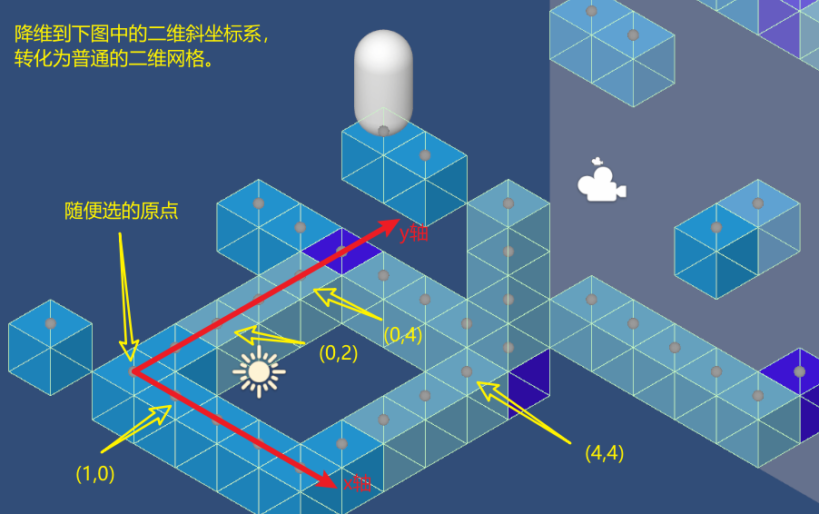

# DreamTicker

崩坏：星穹铁道 2.0 梦境迷钟，简单复刻。只做了一种视角，两个关卡。

使用 Unity 2022.3.19f1 开发，其他版本报错别找我。

## 原理

大体思路如上图。

镜子在斜坐标系里就是个平行四边形，把四个边的直线方程（斜率已知）求出来，就能判断方块在不在镜子里。镜子渲染直接用的模板测试。

具体的解释以后有空再写。

## 示例关卡

在 [Assets/Levels](Assets/Levels) 文件夹里。

1. 哈努兄弟越狱记，深层「梦境迷钟」难度 Ⅲ：

    

2. 哈努兄弟越狱记，深层「梦境迷钟」难度 Ⅴ：

    
